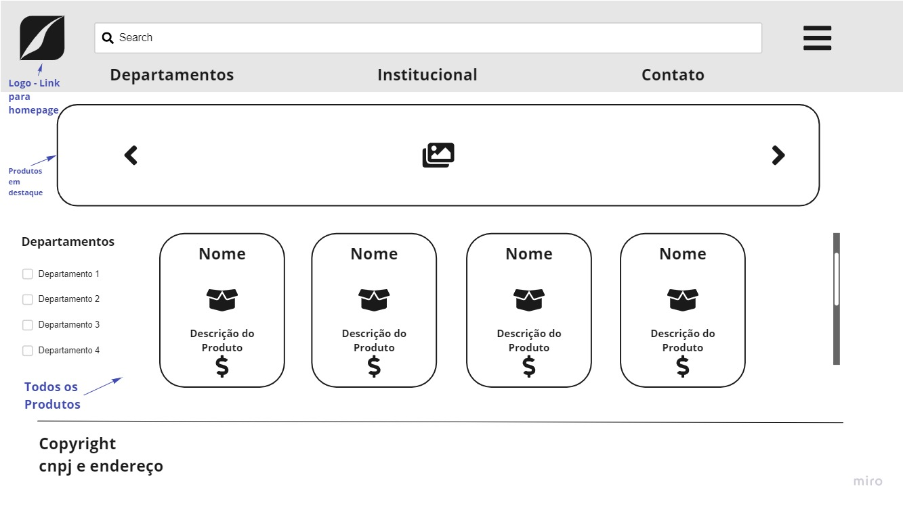
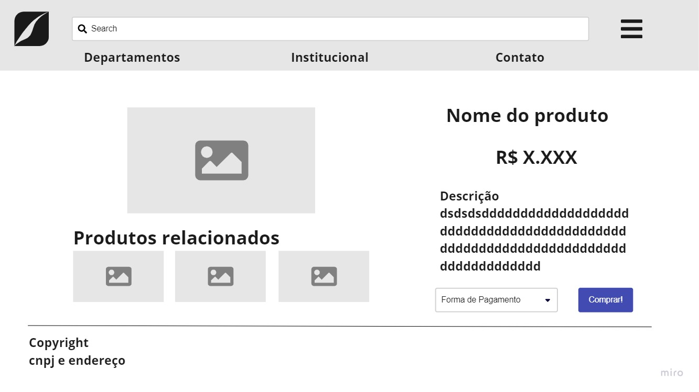

# Mockups e informações do site
Repositório contendo os arquivos produzidos para o Desafio Individual 1 da Gama Academy

## Informações
Nossa loja venderá modelos de navios, e no futuro outros veículos

### Visão
Buscamos alimentar as mentes de entusiastas com máquinas voadoras históricas e ícones modernos, bem como os barcos e navios mais importantes a cruzarem as águas!

### Texto Institucional
Somos uma empresa de importação e distribuição de modelos nacionais e internacionais. Trabalhamos com pequenos e grandes modelistas prezando sempre pela qualidade e fidelidade ao veículo original.

### Contato
Caso você seja um modelista desejando trabalhar conosco ou queira tirar alguma dúvida entre em contato!

___________________________________________________________________________
## Mock-ups

### Homepage

### Página Institucional

### Páginas do Produto

___________________________________________________________________________
# Departamentos

- Avióes
- Helicópteros
- Navios

___________________________________________________________________________
## Página do produto

Produto: Spitfire Mk.XVIe

Descrição: O Supermarine Spitfire foi um avião monomotor de caça, desenvolvido e fabricado na Inglaterra pela Supermarine, entre os anos de 1938 e 1948. Amplamente utilizado na Segunda Guerra Mundial, foi o único caça aliado que operou durante todo o conflito.

Escala: 1/72
Inclui tinta: Não
Inclui material de pintura: Não

Valor: R$ 180,00

